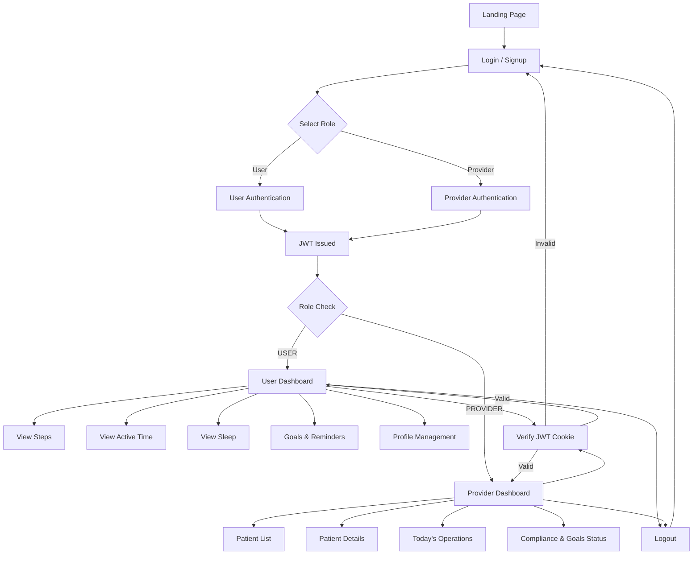

## Contribution and Workdone:
Rama Krishna - done the frontend and backend for the user authentication 
Tech Stack used React.js,Node.js,Express.js,MongoDB.
---
Uday babu - forntend Part (Landing page and Dashboard)
Tech Stack used React.js
---
Shanmukha - backend part (Dashboard)
Tech Stack used springboot
---

## 🧭 System Workflow Diagram



## 🔐 Authentication & Authorization

This application uses **JWT-based authentication** with **role-based authorization** to securely manage access for different user types.

---

## 🧑‍💻 User Roles

The system supports two roles:

| Role | Description |
|------|------------|
| USER | End user / patient |
| PROVIDER | Healthcare provider |

Roles are stored in the database and embedded inside the JWT token.

---

## 🔑 Authentication Flow (JWT)

### Signup
1. User submits email, username, password, and role
2. Backend:
   - Validates input
   - Hashes password using bcrypt
   - Stores user with role in MongoDB
   - Generates JWT containing `{ userId, role }`
3. JWT is sent as an **HTTP-only cookie**

### Login
1. User submits email and password
2. Backend:
   - Verifies credentials
   - Generates JWT with role
   - Stores JWT in cookie
3. User is redirected based on role

---

## 🪪 JWT Structure

```json
{
  "id": "user_id",
  "user_name" : "username",
  "email" : "mail id",
  "role": "USER | PROVIDER",
  "Password" : "bcrypt hased password",
  "iat": 1710000000,
  "exp": 1710086400
}

