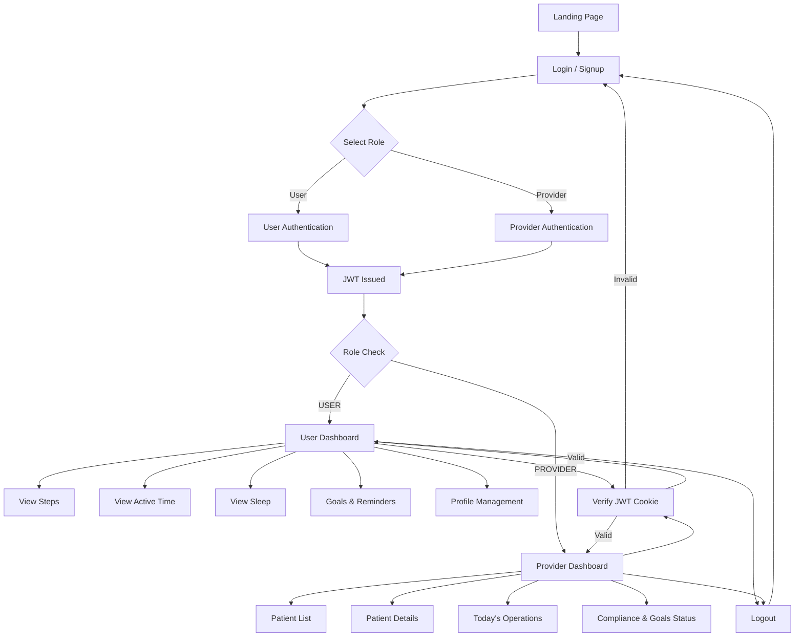

## Contribution and Workdone:
Rama Krishna - done the frontend and backend for the user authentication 
Tech Stack used React.js,Node.js,Express.js,MongoDB.
---
Uday babu - forntend Part (Landing page and Dashboard)
Tech Stack used React.js
---
Shanmukha - backend part (Dashboard)
Tech Stack used springboot
---

## 🧭 System Workflow Diagram



## 🔐 Authentication & Authorization

This application uses **JWT-based authentication** with **role-based authorization** to securely manage access for different user types.

---

## 🧑‍💻 User Roles

The system supports two roles:

| Role | Description |
|------|------------|
| USER | End user / patient |
| PROVIDER | Healthcare provider |

Roles are stored in the database and embedded inside the JWT token.

---

## 🔑 Authentication Flow (JWT)

### Signup
1. User submits email, username, password, and role
2. Backend:
   - Validates input
   - Hashes password using bcrypt
   - Stores user with role in MongoDB
   - Generates JWT containing `{ userId, role }`
3. JWT is sent as an **HTTP-only cookie**

### Login
1. User submits email and password
2. Backend:
   - Verifies credentials
   - Generates JWT with role
   - Stores JWT in cookie
3. User is redirected based on role

---

## 🪪 JWT Structure

```json
{
  "id": "user_id",
  "user_name" : "username",
  "email" : "mail id",
  "role": "USER | PROVIDER",
  "Password" : "bcrypt hased password",
  "iat": 1710000000,
  "exp": 1710086400
}
```

# 🏥 Healthcare Backend Service(Note Read healthcare file not Backend1/Backend/healthcare)

### This repository contains the backend service for the Healthcare application.
### It is built using Spring Boot, Spring Data JPA, Hibernate, and PostgreSQL, and runs using a Dockerized PostgreSQL database.

# 🛠 Tech Stack

### Java 21
### Spring Boot
### Spring Data JPA
### Hibernate ORM
### PostgreSQL
### Docker
### Maven

# 📦 Features

### User management
### Provider management
### Appointments handling
### User goals (1–1 mapping with users)
### Random health tips
### UUID-based primary keys
### Database auto-initialization using SQL scripts

**🐳 Running PostgreSQL Using Docker**
The backend uses PostgreSQL running inside Docker.

## Pull and Run PostgreSQL Container
```
docker run -d \
  --name postgres-db \
  -e POSTGRES_DB=healthcare \
  -e POSTGRES_USER=postgres \
  -e POSTGRES_PASSWORD=postgres \
  -p 5432:5432 \
  postgres:16
```
## What this command does
1.docker run -d → runs container in background
2.--name postgres-db → names the container
3.POSTGRES_DB → creates healthcare database
4.POSTGRES_USER / PASSWORD → DB credentials
5.-p 5432:5432 → exposes PostgreSQL to localhost
6.postgres:16 → official PostgreSQL image
## ⚙️ Application Configuration
### application.properties
```
spring.datasource.url=jdbc:postgresql://localhost:5432/healthcare
spring.datasource.username=postgres
spring.datasource.password=postgres

spring.jpa.hibernate.ddl-auto=validate
spring.jpa.show-sql=true
spring.jpa.open-in-view=false
```
## Database Schema & Data Initialization
##### Database schema is defined using SQL
##### Initial data is populated via data.sql
##### UUIDs are used as primary keys
##### PostgreSQL extension uuid-ossp is enabled

## 📄 SQL Files Used
**schema.sql** – creates tables
**data.sql** – inserts default providers, users, goals, appointments, and tips
Spring Boot automatically executes these files at startup.

## 🔁 ORM & Persistence

##### Spring Data JPA is used for repositories
##### Hibernate handles:
##### Entity mapping
##### Relationships (@ManyToOne, @OneToOne)
##### UUID ID generation
No native queries unless required

## Entity Relationships
1.Provider → Users (One-to-Many)

2.User → Goals (One-to-One, shared primary key)

3.Provider ↔ User → Appointments (Many-to-One)

4.Tips stored independently

## ▶️ Running the Backend
### 1️⃣ Start PostgreSQL
```
docker start postgres-db
```
### 2️⃣ Run Spring Boot Application
```
mvn spring-boot:run
```
Application will start on:
```
http://localhost:8080
```
## 📡 Example Endpoint
```
GET /users/22222222-2222-2222-2222-222222222222/dashboard
```
## Returns:
```
{
    "id": "22222222-2222-2222-2222-222222222222",
    "name": "John Doe",
    "goals": {
        "steps": 10000,
        "sleeptime": 8,
        "activeTimeInMinutes": 60
    },
    "remainders": {
        "items": [
            "John Doe at 2026-01-20"
        ],
        "total": 1,
        "returned": 1
    },
    "tip": "Drink at least 2 liters of water daily"
}
```
1. User info
2. Goals
3. appointment Remainders
4. Random health tip

## 🛑 Error Handling
1.Global exception handling implemented using @ControllerAdvice

2.Meaningful HTTP status codes and error messages returned


## 🧪 Development Notes

1.UUIDs prevent ID collision across systems

2.Docker ensures consistent DB environment

3.SQL-based initialization avoids Hibernate schema drift

4.Clear separation of DTOs, entities, repositories, and services 
